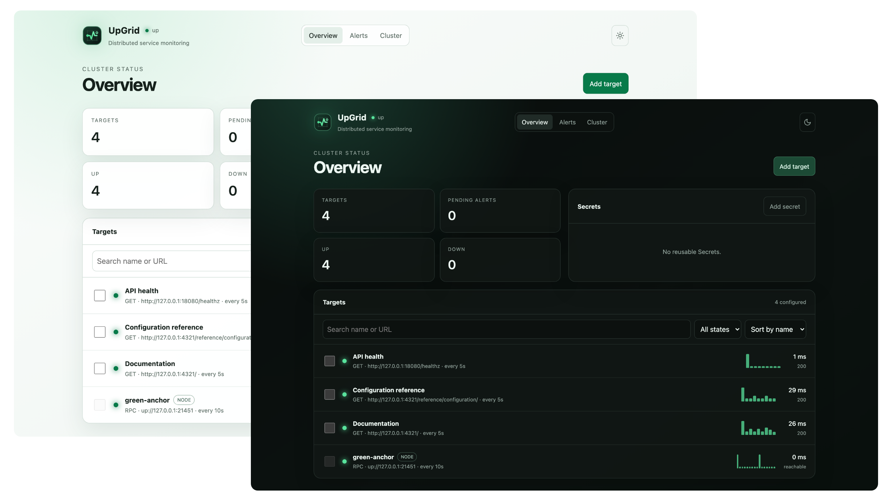

# UpGrid

Distributed uptime monitoring that stays available with your infrastructure.

[Website](https://upgrid.rs) · [Documentation](https://upgrid.rs/getting-started/installation/) · [HTTP API](https://upgrid.rs/reference/api/) · [Deployment guide](https://upgrid.rs/reference/deployment/)



UpGrid is a self-contained, Raft-backed service monitor. Run one binary for a capable uptime dashboard, or join several Nodes into a resilient Cluster without adding a separate database, queue, or control plane.

Every Node exposes the same authenticated API and responsive WebUI. Followers transparently forward changes to the leader, reads come from replicated state after a linearizable barrier, and polling work is distributed across voting members.

## Why UpGrid

- **One binary, no external database.** The API, WebUI, scheduler, probe workers, notifications, and durable Raft state travel together.
- **A useful interface on every Node.** Manage Targets, inspect latency and availability history, and operate the Cluster from any healthy member.
- **Distributed monitoring.** The leader assigns each polling interval to one Node, commits one authoritative result, and preserves failure streaks across leader changes.
- **Flexible HTTP checks.** Use any HTTP method with configurable timeouts, redirects, status ranges, headers, bodies, Secrets, and consecutive-failure thresholds.
- **Actionable notifications.** Deliver service and Cluster Node transitions through Telegram or webhooks, with default Channels and at-least-once delivery.
- **Simple expansion.** Create an expiring, revocable `up://` Join Token in the WebUI and start another Node with `--join`.

## Quick start

Docker is the preferred installation method. Every `main` commit is published as a multi-architecture image named `main-<6-character-commit>`, while stable releases use their Git tag. Start a single Node with persistent storage using `v0.1.0`:

```sh
docker run --name upgrid \
  --publish 8080:8080 \
  --publish 11451:11451/udp \
  --volume upgrid-data:/var/lib/upgrid \
  --env UPGRID_USERNAME=admin \
  --env UPGRID_PASSWORD='replace-this-password' \
  ghcr.io/george-miao/upgrid:v0.1.0
```

Open [http://127.0.0.1:8080/setup](http://127.0.0.1:8080/setup), sign in, review the generated Node name, and choose **Create new Cluster**. The guided setup can add your first notification Channel and service Target, or skip either step.

Set `UPGRID_RAFT_URL` to a hostname reachable by every Node before expanding this container into a multi-Node Cluster.

See the [environment-variable reference](https://upgrid.rs/reference/configuration/#settings) for every container setting and its default.

### Precompiled Linux binaries

When a container runtime is not appropriate, use a published Linux binary from the [v0.1.0 release](https://github.com/George-Miao/UpGrid/releases/tag/v0.1.0):

- [Linux AMD64](https://github.com/George-Miao/UpGrid/releases/download/v0.1.0/upgrid-v0.1.0-linux-amd64.tar.gz)
- [Linux ARM64](https://github.com/George-Miao/UpGrid/releases/download/v0.1.0/upgrid-v0.1.0-linux-arm64.tar.gz)
- [SHA-256 checksums](https://github.com/George-Miao/UpGrid/releases/download/v0.1.0/SHA256SUMS)

Download the archive for the host architecture, verify it against `SHA256SUMS`, then extract and run `upgrid`.

### Build from source

Source builds are intended for contributors and unsupported targets. The repository provides a reproducible Nix development shell with the required Rust, Node, and native tooling.

```sh
git clone https://github.com/George-Miao/UpGrid.git
cd UpGrid
nix develop
cargo run -p upgrid -- \
  --username admin \
  --password 'replace-this-password'
```

State is stored in `upgrid-data/` by default. Use a durable, unique data directory for each Node.

## Grow into a Cluster

Open **Cluster**, choose **Create token**, and configure its expiration and usage limit. Then start a fresh Node with the generated token:

```sh
upgrid \
  --join 'up://existing-node.example/opaque-token' \
  --bind 127.0.0.1:8081 \
  --raft-url up://node-2.internal:11451 \
  --data-dir upgrid-data-2 \
  --username admin \
  --password 'replace-this-password'
```

The Join Token contains admission authority and deployment material. Treat it as a password, transfer it through a trusted channel, and revoke reusable tokens after provisioning. Every advertised `up://` address must be reachable by every Cluster member.

See [Join a Cluster](https://upgrid.rs/guides/join-cluster/) for browser and unattended workflows.

## How it works

1. A request reaches any Node. Mutations are forwarded to the Raft leader; consistent reads use the local replicated state.
2. The leader assigns due evaluations across voting Nodes. The first accepted result for an interval becomes authoritative.
3. Replicated policy turns results into **Up**, **Suspicious**, **Down**, or **Paused** state.
4. Availability transitions enter a replicated outbox and are delivered to the Target's notification Channels.

The HTTP API can run behind a TLS-terminating reverse proxy or serve HTTPS directly. `/healthz` is public; the WebUI and remaining API routes use Basic authentication. Never expose Basic credentials over untrusted plaintext transport.

## Development

```sh
cargo fmt --all -- --check
cargo clippy --workspace --all-targets --all-features -- -D warnings
cargo test --workspace --no-run
scripts/test-webui.sh
scripts/verify-local-cluster.sh
```

The Lit frontend lives in `frontend/`; the Starlight documentation site lives in `website/`. Run `scripts/update-webui.sh` after frontend changes and `scripts/update-openapi.sh` after API route or schema changes.

## Project status

The self-contained MVP is complete and development now follows small, agile iterations. UpGrid is suitable for evaluation and self-hosted experimentation; authentication and Cluster membership operations are still being hardened. Current follow-up work is tracked in [TODO.md](TODO.md).

## Acknowledgements

Proudly powered by [Compio](https://compio.rs/) and [OpenRaft](https://github.com/databendlabs/openraft).
